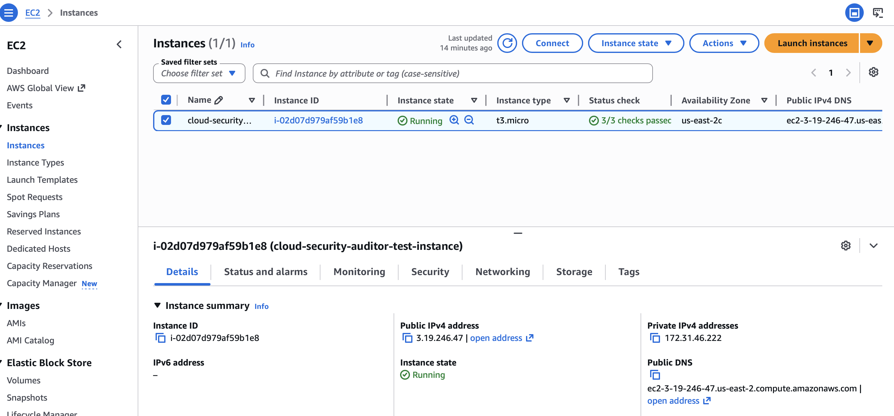
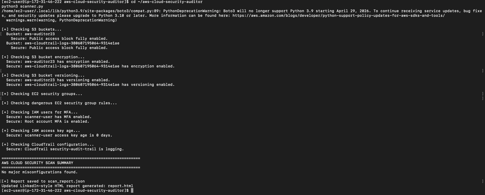
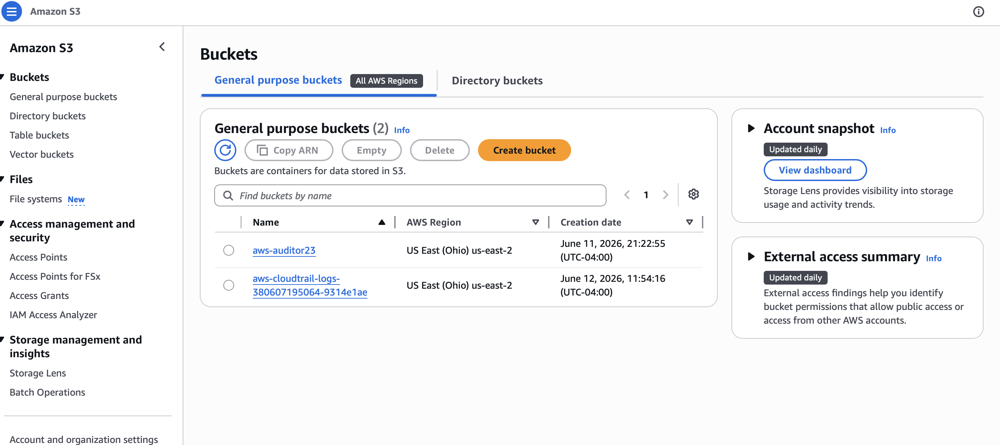
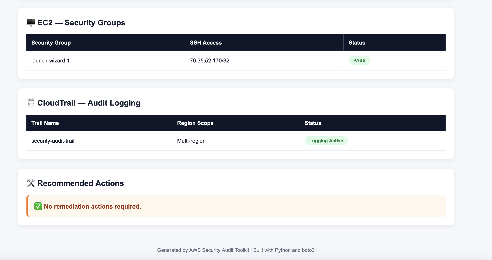
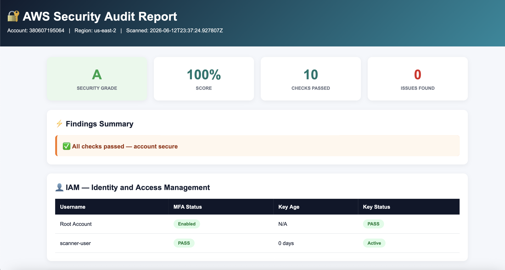
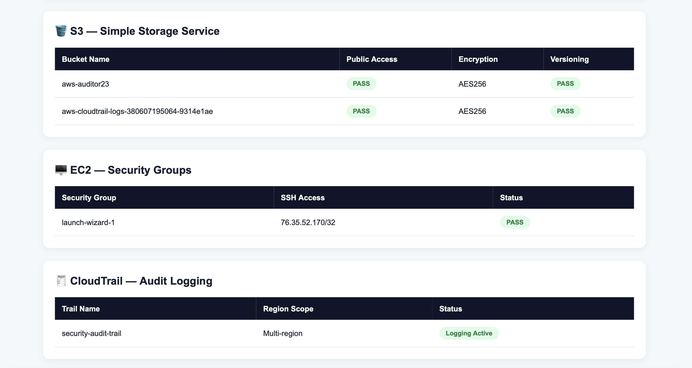

# AWS Cloud Security Auditor

Automated AWS cloud security auditing tool built in Python that scans AWS infrastructure for security misconfigurations and generates a visual HTML security report.

The scanner analyzes common AWS security risks across IAM, S3, EC2 Security Groups, and CloudTrail, calculates a security score, and provides remediation recommendations.


---

## 🚀 Deployment

Tested and deployed on Amazon EC2 (Amazon Linux) using Python, AWS CLI, and Boto3 to perform live security assessments against AWS resources.

---

## 🔍 Security Checks

### IAM — Identity and Access Management

| Check           | What It Detects                                    | Severity  |
| --------------- | -------------------------------------------------- | --------- |
| User MFA Status | IAM users without multi-factor authentication      | 🟠 Medium |
| Root MFA        | Root account without MFA protection                | 🔴 High   |
| Access Key Age  | Access keys older than recommended rotation period | 🟡 Medium |

---

### S3 — Simple Storage Service

| Check               | What It Detects                     | Severity    |
| ------------------- | ----------------------------------- | ----------- |
| Public Access Block | Buckets accessible by anyone online | 🔴 Critical |
| Encryption Status   | Buckets without AES256 encryption   | 🟡 High     |
| Access Logging      | Buckets without audit trail logging | 🟠 Medium   |

---

### EC2 — Security Groups

| Check                | What It Detects                                      | Severity |
| -------------------- | ---------------------------------------------------- | -------- |
| Open SSH Access      | Security group allowing `0.0.0.0/0` on port 22       | 🔴 High  |
| Public Inbound Rules | Security group allowing unrestricted inbound traffic | 🔴 High  |

---

### CloudTrail — Audit Logging

| Check             | What It Detects                                | Severity |
| ----------------- | ---------------------------------------------- | -------- |
| CloudTrail Status | AWS account without CloudTrail logging enabled | 🔴 High  |

---

## 🛠 What I Used To Build This

* Python - core scripting langauge
* Boto3 - official AWS SDK for Python
* AWS CLI - command line toll for AWS
* Amazon EC2 - Elastic Compute Cloud Service
* AWS IAM - Identity Access and Management Service
* Amazon S3 - Simple Storage Service
* AWS CloudTrail - Audit logging and monitoring service 
* VS Code - development environment

---

## 📋 Real Output From My AWS Account

```text
=======================================================
   AWS SECURITY AUDIT — IAM + S3 + EC2 + CLOUDTRAIL
=======================================================

🔍 CHECK 1: S3 Bucket Public Access
  📦 Bucket: security-test-2026
  ✅ SAFE | Public access block fully enabled

🔍 CHECK 2: S3 Bucket Encryption
  📦 Bucket: security-test-2026
  ✅ SAFE | Encryption enabled

🔍 CHECK 3: EC2 Security Groups
  ⚠️ WARNING | Open inbound rule to 0.0.0.0/0 on port 22

🔍 CHECK 4: IAM User MFA Status
  ⚠️ WARNING | IAM user does not have MFA enabled

🔍 CHECK 5: IAM Access Key Age
  ✅ SAFE | Access key age within policy

🔍 CHECK 6: CloudTrail Configuration
  ⚠️ WARNING | CloudTrail is not enabled

Detected Issues:
- EC2 security group open to internet
- IAM user without MFA
- Root account MFA not enabled
- CloudTrail logging disabled

Report saved to: scan_report.json
```

---

## 🏗 How It Works

```text
Your Laptop / EC2 Instance
            │
            │ Python Boto3 API Calls
            ▼

        AWS Account
        ├── IAM
        │    ├── MFA Checks
        │    ├── Access Key Review
        │    └── Root Account Audit
        │
        ├── S3
        │    ├── Public Access Check
        │    ├── Encryption Check
        │    └── Logging Verification
        │
        ├── EC2
        │    └── Security Group Analysis
        │
        └── CloudTrail
             └── Logging Validation

            ▼

     Security Findings Engine

            ▼

 HTML Dashboard + JSON Report
```

---

## 📸 Screenshots

### Security Dashboard



### Terminal Scan Execution



### AWS Resources Tested



### S3 Buckets



### Security Report



### CloudTrail & Recommendations



---

## 🚀 Run This Yourself

### Requirements

* Python 3.9+
* AWS Account
* AWS CLI Configured
* Boto3

### Clone Repository

```bash
git clone https://github.com/Niru-ui/aws-cloud-security-auditor.git
cd aws-cloud-security-auditor
```

### Install Dependencies

```bash
pip install -r requirements.txt
```

### Configure AWS Credentials

```bash
aws configure
```

### Run Security Scan

```bash
python3 scanner.py
```

### Open Report

```bash
open report.html
```

---

## 📄 Generated Output Files

```text
report.html
security_report.html
scan_report.json
```

---

## 🌍 Real-World Impact

| This Tool Catches    | Security Risk              |
| -------------------- | -------------------------- |
| No MFA on users      | AWS account takeover       |
| Public S3 buckets    | Data exposure and breaches |
| Open Security Groups | Unauthorized access        |
| Disabled CloudTrail  | Missing audit visibility   |
| Old Access Keys      | Credential compromise      |

---

## 🔑 Skills Demonstrated

* AWS Cloud Security
* IAM Security Controls
* Security Auditing
* Cloud Misconfiguration Detection
* Security Group Analysis
* CloudTrail Monitoring
* Python Automation
* Boto3 Development
* Risk Assessment
* Security Reporting

---

## 🔮 Future Enhancements

* CIS AWS Benchmark Checks
* AWS Config Integration
* AWS Security Hub Integration
* Multi-Account Scanning
* PDF Report Generation
* Automated Remediation Recommendations
* Continuous Security Monitoring Dashboard

---

## 📍 About

Hands-on cloud security project built to identify AWS misconfigurations using Python and the AWS SDK (Boto3).

The tool scans AWS services including IAM, S3, EC2 Security Groups, and CloudTrail to detect security risks and generate visual security reports with remediation guidance.

Designed and deployed on Amazon EC2 as part of practical cloud security engineering and AWS security automation learning.

